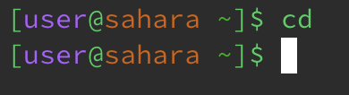
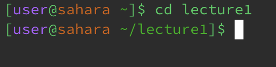
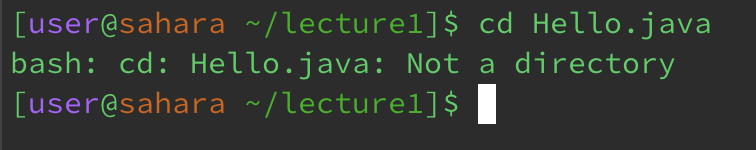
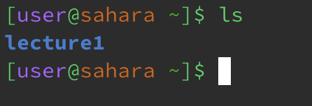
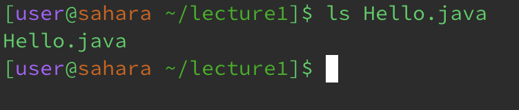
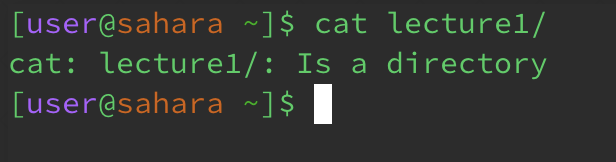
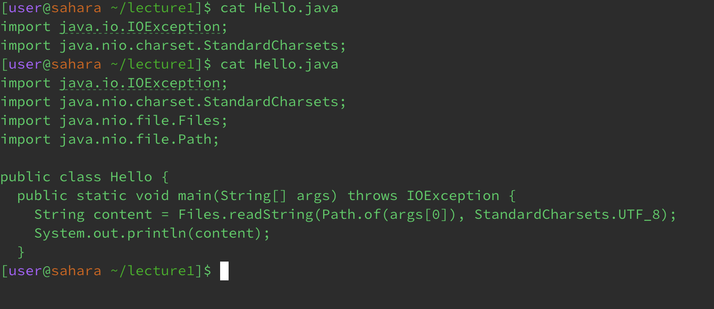

# Lab Report 1
Daniel Bravo

## cd
1. cd no arguments
   * 
   * Working Directory: /home
   * The output was nothing because cd means to change directory. If there is no path provided, the directory will not change.
   * No error
     
2. cd with a path to a directory as an argument
   * 
   * Working Directory: /home
   * The output was nothing because cd means to change directory. However, because a path was provided, the directory changed.
   * No error
     
3. cd with a path to a file as an argument
   * 
   * Working Directory: /home/lecture1
   * The output was an error saying that Hello.java is not a directory. This is because Hello.java is a file, so cd doesn't apply to it.
   * There was an error because cd uses directories as paths, not files.

## ls
1. ls no arguments
   * 
   * Working Directory: /home
   * The output displayed lecture1. This is because the command ls lists files and folders from given path.
   * No error

2. ls with a path to a directory as an argument
   * 
   * Working Directory: /home
   * The output displayed all the files and folders in lecture 1. This is because the command ls lists files and folders from given path.
   * No error

3. ls with a path to a file as an argument
   * 
   * Working Directory: /home/lecture1
   * The output displayed Hello.java. This is because the command ls listed the file itself, so it just outputted the file name.
   * No error
  

## cat
1. cat no arguments
   * 
   * Working Directory: /home
   * The output was nothing. This is because cat without an argument will read from stdin.
   * No error
  
2. cat wiht a path to a directory as an argument
   * 
   * Working Directory: /home
   * The output shows an error telling you the path is a directory. This is because cat displays text within a file.
   * There was an error because cat is used on files not directories

3. cat with a path to a file as an argument
   * 
   * Working Directory /home/lecture1
   * The output shows the text in Hello.java. This is because Hello.java is a file and cat outputs all the text in the file.
   * No error
